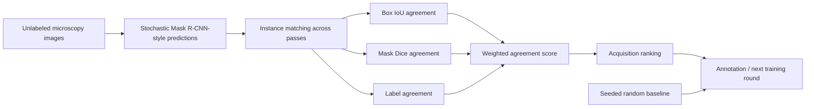

# Active Learning for Microscopy Instance Segmentation

**Agreement-based sample acquisition from repeated stochastic instance-segmentation predictions**

[](https://github.com/Zelong-G/microscopy-active-learning/actions/workflows/ci.yml)


This repository is a **clean research-code reconstruction** of an earlier project exploring annotation-efficient instance segmentation of microscopy images, including red and white blood cell (RBC/WBC) imagery. Its main contribution is an inspectable active-learning selection pipeline based on agreement among repeated predictions.

The original experiments used a Mask R-CNN-style model with stochastic feature perturbation (a custom DropBlock-like module in the feature pyramid network), then compared uncertainty-driven acquisition with random image selection. The public version retains the **sample-scoring and selection logic**, independent of the historical training setup.

> **Scope:** This repository does not bundle microscopy images, annotations, model checkpoints, the historical Mask R-CNN implementation, or unverified experimental accuracy numbers. The synthetic demo is a functional illustration, **not a reproduced medical benchmark**.

## Research question

Given a limited annotation budget, which unlabeled images should be selected next for an instance-segmentation model?

Repeated stochastic predictions can reveal disagreement in **object localization, masks, and category assignments**. This implementation aligns detected instances across passes, computes consistency scores, and ranks candidates by a simple acquisition heuristic.



### Technical highlights

- **Multi-pass agreement:** anchor the pass with the most detections and align instances across remaining passes using deterministic greedy one-to-one box-IoU matching.
- **Three interpretable signals:** detection IoU, mask Dice, and category consistency. Unmatched instances contribute zero agreement.
- **Acquisition score:** weighted mean agreement, transformed into `1 - agreement`; larger values are queried first.
- **Explicit edge cases:** images with no detected instances are marked `all_empty` rather than assigned a misleading confidence; identical passes are marked `has_variation=False`.
- **Fair baseline interface:** seeded random selection and uncertainty ranking share a fixed candidate pool and annotation budget.
- **Non-destructive data handling:** scripts write CSV selection manifests; they do not move or rename training images.

The scores are **agreement heuristics, not calibrated predictive uncertainty**. Repeating a deterministic model in `eval()` mode will not generate meaningful disagreement. Stochasticity must be supplied by the prediction mechanism. See [Method](docs/METHOD.md).

## Quick start

```bash
git clone https://github.com/Zelong-G/microscopy-active-learning.git
cd microscopy-active-learning

python -m venv .venv
source .venv/bin/activate
python -m pip install --upgrade pip
python -m pip install -e ".[dev]"
```

Run the dataset-free example:

```bash
python scripts/demo.py --output-dir outputs/demo
```

This writes:

```text
outputs/demo/
  scores.csv
  uncertainty_selection.csv
  random_selection.csv
```

You can also run each stage explicitly:

```bash
python scripts/score_predictions.py \
  --input examples/predictions.json \
  --output outputs/scores.csv

python scripts/select_samples.py \
  --scores outputs/scores.csv \
  --strategy uncertainty \
  --budget 2 \
  --output outputs/query_uncertainty.csv

python scripts/select_samples.py \
  --scores outputs/scores.csv \
  --strategy random --seed 42 \
  --budget 2 \
  --output outputs/query_random.csv

pytest -q
```

The `examples/predictions.json` file contains only artificially constructed masks, boxes, and labels. **No patient data or copyrighted images** are needed for the demo.

## Connecting a real segmentation model

The model-independent interface is `Prediction(instances=(...))`, where each instance contains an XYXY box, class label, and **full-image binary mask**. `from_torchvision_output()` converts standard `torchvision` Mask R-CNN-style outputs without vendoring that library.

To use real experiments:

1. supply properly licensed microscopy data and annotations;
2. train or load a segmentation model in your own environment;
3. generate **genuinely stochastic** repeated predictions per unlabeled image, while keeping the annotated/validation/test splits separate;
4. export the repeated boxes, labels, and masks using the schema in [Method](docs/METHOD.md);
5. score and query samples with the scripts above;
6. compare against seeded random selection at identical budgets and seeds.

This release intentionally does **not** claim an end-to-end, immediately reproducible historical Mask R-CNN training pipeline. The earlier code and environment depended on unavailable project-specific data and older dependency versions.

## Code layout

```text
active_learning/
  types.py         instance/prediction contracts
  geometry.py      bounding-box IoU and mask Dice
  matching.py      reproducible one-to-one matching
  scoring.py       three-channel agreement/acquisition scores
  selection.py     uncertainty and seeded-random strategies
  io.py            JSON inputs and CSV manifests
  adapters.py      optional torchvision-style output adapter
scripts/
  demo.py
  score_predictions.py
  select_samples.py
tests/             dataset-free algorithmic and I/O tests
examples/          original synthetic repeated predictions
docs/
  METHOD.md
  REPRODUCIBILITY.md
```

## Experimental evidence

Historical code shows experiments for RBC and WBC instance segmentation, uncertainty-based sample selection, and a random-selection comparison. However, the public repository does not contain independently verifiable original split manifests, checkpoints, or evaluation logs. **No performance improvement or SOTA claim is made here.**

See [Reproducibility](docs/REPRODUCIBILITY.md) for a transparent protocol for future experiments and result reporting.

## Author

**Zelong Zheng** · Technical University of Munich (TUM)

Research interests: 3D computer vision, multimodal perception, autonomous driving, and visual localization. This earlier project demonstrates transferable experience in instance segmentation, uncertainty analysis, and controlled sampling experiments.

GitHub: [Zelong-G](https://github.com/Zelong-G)

## Citation and third-party software

Citation metadata: [CITATION.cff](CITATION.cff). This public package includes **no vendored Mask R-CNN or torchvision source**. Dependencies and research provenance are described in [THIRD_PARTY.md](THIRD_PARTY.md).

## License and reuse

No open-source license has been granted for this repository at this time. The source is visible for academic review and portfolio evaluation; contact the author before copying or redistribution. Upstream assets and libraries remain under their respective licenses.
